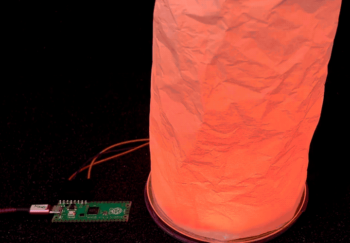

# circuitpython_led_effects

Some fun with Neopixel / WS2812 LEDs in CircuitPython

A growing list of LED effects. So far:

* fire1 -- simple fire simulation, uses ulab
  

* ulab_speedup -- how to use ulab (CircuitPython Numpy) to speed up LED animations
